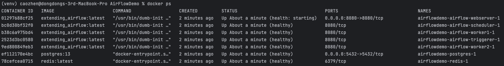
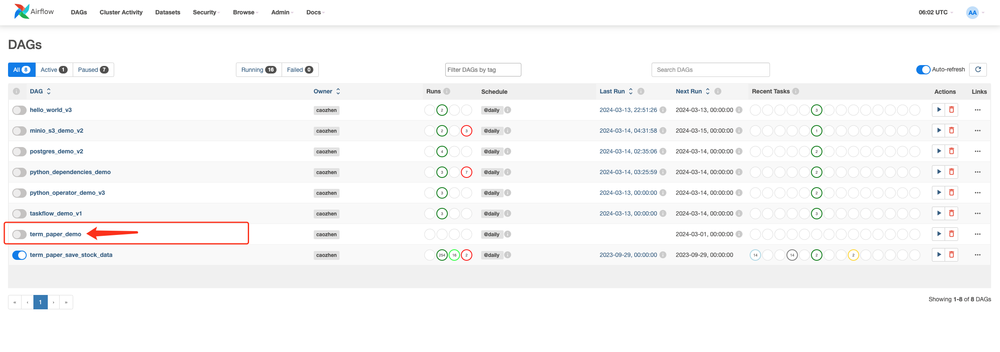

# 1. Set up environment

## 1.1 python

```bash
pwd
```

```bash
python3 --version
```

```bash
python 3 -m venv py_env
```

```bash
source py_env/bin/activate
```


## 1.2 airflow

### 1.2.1

```bash
pip install 'apache-airflow==2.8.3' \
 --constraint "https://raw.githubusercontent.com/apache/airflow/constraints-2.8.3/constraints-3.8.txt"
```

```bash
curl -LfO 'https://airflow.apache.org/docs/apache-airflow/2.8.3/docker-compose.yaml'
```

```bash
mkdir -p ./dags ./logs ./plugins ./config
```

```bash
docker compose up airflow-init
```


### 1.2.2 

in docker-cmopose.yaml replace image:

```yaml
# image: ${AIRFLOW_IMAGE_NAME:-apache/airflow:2.8.3}
image: ${AIRFLOW_IMAGE_NAME:-extending_airflow:latest}
```

dockerfile

```bash
FROM apache/airflow:2.8.3
COPY requirements.txt /requirements.txt
RUN pip install --user --upgrade pip
RUN pip install --no-cache-dir --user -r /requirements.txt
```

requirements.txt

```
pandas==2.0.3
yfinance==0.2.31
psycopg2-binary
scikit-learn==1.3.2
numpy==1.23.5
keras==2.13.1
tensorflow==2.13.1
```


```bash
docker build . --tag extending_airflow:latest
```

This command builds a Docker image named `extending_airflow` and tags it as `latest`. Specifically, it searches for a file named `Dockerfile` in the current directory and follows the instructions provided in that file to build the image. During the build process, each command in the `Dockerfile`, such as `FROM`, `COPY`, `RUN`, etc., is executed to create the image with the required environment and application. Once the build is complete, the resulting image is labeled with the specified tag, which can be `latest` to indicate it as the most recent version.


### 1.2.3

```bash
docker compose up -d
```


```bash
docker ps
```




## 1.3 minio

```
mkdir -p ~/minio/data

docker run \
   -p 9000:9000 \
   -p 9001:9001 \
   --name minio \
   -v ~/minio/data:/data \
   -e "MINIO_ROOT_USER=ROOTNAME" \
   -e "MINIO_ROOT_PASSWORD=CHANGEME123" \
   quay.io/minio/minio server /data --console-address ":9001"
```


## 1.4 create connection using Airflow UI


### 1.4.1 postgres connection


### 1.4.2 minio connection


# 2. Run

Go to http://localhost:8080/ Airflow UI and DAGs.



Then run it.


# 3. DAG


```
task1 >> task2 >> model_sensor >> [task3, task4, task5] >> task6
```


**task1 - query_stock_info:**

Connect to local database -> create table if not exist -> get and save stock data in local postgres database(table name: stock_info)


**task2 - processed_stock_data:**

Save the projection of column ['Stock_Name', 'Date', 'Open', 'Close'] to table 'processed_stock_data'


**model_sensor - check_models_in_minio:**

check if the models in minio, if not wait until it is saved in minio. (Timeout, poke_interval)


**task3, 4, 5 - 3 models:**

Load models from minio

Each one will give the results 1 or 0, 1 means good stock, 0 means bad


**task6 - make_investment_decision:**

Make investment decision based on Task 3,4,5

Only if the prediction results of more than or equal to two models are good stocks, the final result is a good stock.


# 4. Dataset and Results

## 4.1 dataset


Our program will download the specified stocks dataset from Yahoo. Here is a screen shot of dataset:

stock_name: Stock name in Yahoo, apple -> AAPL, Nvdia -> NVDA

date: date of the stock

open: open price is the price at which a particular stock starts trading when the stock market opens for the day

high: the highest price of the stock in a day

low: the lowest price of the stock in a day

close: close price is the final price at which a particular stock is traded on a given trading day

volume: the total number of shares or contracts traded

adj_close: adjusted close price is the final price adjusted before the next trading day

short_ma: short-term moving average of a financial metric

long_ma: long-term moving average of a financial metric


## 4.2 Results

```postgresql
SELECT psd.date,
       psd.stock_name,
       psd.open,
       psd.close,
       sp.prediction,
       (psd.close - psd.open) AS earning
FROM processed_stock_data psd
JOIN stock_prediction sp ON psd.date = sp.date AND psd.stock_name = sp.stock_name
WHERE psd.stock_name = 'NVDA';
```

You can use this SQL to see your stock results.

Below are some examples of our results with stock NVDA, 

### 4.2.1 NVDA


3 correct, 6 wrong predictions

### 4.2.2 GOOGL


6 correct, 3 wrong predictions

### 4.2.3 AMZN


5 correct, 4 wrong predictions

